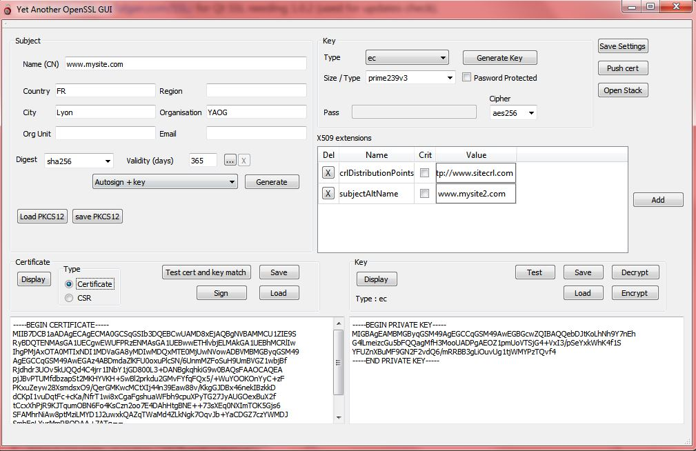
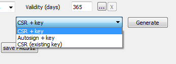

Documentation
===============

About
-----

This software is all about creating certs/csr and keys quickly. 

It will let you generate certificates of any kind, even if they are not secure (RSA 512 + md5 for example), or with incompatible X509 extensions.

Remember to save you certificates and keys if you need them, as the software won't warn you about unsaved changes !

Below is a quick documentation of main features, and a full step by step example is available 

Main Window
-----------

The main window has all you need : 

* Subject : all elements that will be set in your certificate / CSR. Only the CN will be set in a new CSR
* Key : type / length of key to generate. Check "password protected" to encrypt your key
* X509 extensions
* "Generate button" : see below

Generate button
---------------

you can generate :

* CSR + key : this will generate a CSR with the CN entered in "subject" and the key type/length/encryption in "key" group.

* Autosign + key : this will generate a X509 certificate with all elements in "subject" group (if not empty), key and extensions. The certificate will use it's own private key to sign itself

* CSR (existing key) : this will generate a CSR with the CN entered and the key in entered in PEM format at the lower right.

Note : the "generate key" button will only generate a key.

Certificate buttons
-------------------

* Display : display in human readable format the current certificate.

* Save/load : Save/load on disk

* Test cert & key match : check the certificate/csr public key is related to the private key in the "Key" box.

* Sign : sign a csr with the cert/key defined in the stack window

Key buttons
-----------

* Display : display in human readable format the current key

* Save/load : Save/load on disk

* Test : test if the key is correct (doesn't work for DSA)

* Encrypt/Decrypt : encrypt or decrypt the key and output result in PEM format. Cipher used is the one in the top "Key" group.

PKCS12
------

Save or load pkcs12 format.
You can add certificate (previously saved on disk) with the current cert/key in a single P12
On the load dialog box, you can load the main certificate/key ("Import cert & key") or the other certificates in the P12 container.

Misc buttons
------------

Save Settings : save all the subject entries and all the X509 extensions in the default.ini file located in the installation directory

Updates Check
-------------

First time you launch the software, it will ask you if you want to check for updates.
To change this, edit the default.ini file and change the "checkupdate" variable to: 

* 0 : no update checks
* 1 : check updates
* 3 : ask again next launch